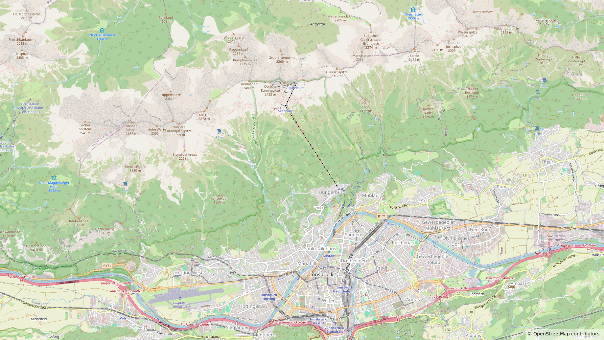
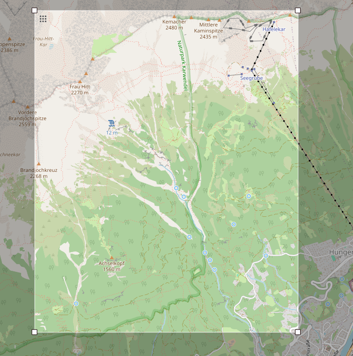

# Example: Nordkette

This example demonstrates a full AvaSimRT pipeline run on a real alpine terrain ([Nordkette, Innsbruck](https://www.openstreetmap.org/?#map=13/47.29122/11.38759)).

## About the Nordkette

The Nordkette is a mountain range in the Karwendel Alps, located directly north of Innsbruck, Austria.
As this area is host to [avalanche testing](https://www.bfw.gv.at/der-blick-ins-innere-der-lawine/), the steep alpine terrain provide realistic conditions for testing and validating avalanche simulation models.


_Overview of the Nordkette area near Innsbruck_


_Exact simulation area extent (3.4 x 4.1 km)_

> 11.34278,47.27620,11.38767,47.31334

## How to run

From the project root:

```bash
avasimrt --config examples/nordkette/config.yml
```

## Regression Test Configurations

The example includes several partial configuration files that can be used to test individual preprocessing stages of the simulator:

| File                        | Target                                       | Output                                                                |
| --------------------------- | -------------------------------------------- | --------------------------------------------------------------------- |
| 01-preprocess-full.yml      | Tests the complete Blender export pipeline   | terrain mesh, materials, and scene data from the Blender file         |
| 02-preprocess-heightmap.yml | Tests heightmap generation from terrain mesh | Generates a heightmap at specified resolution from the .obj mesh file |
